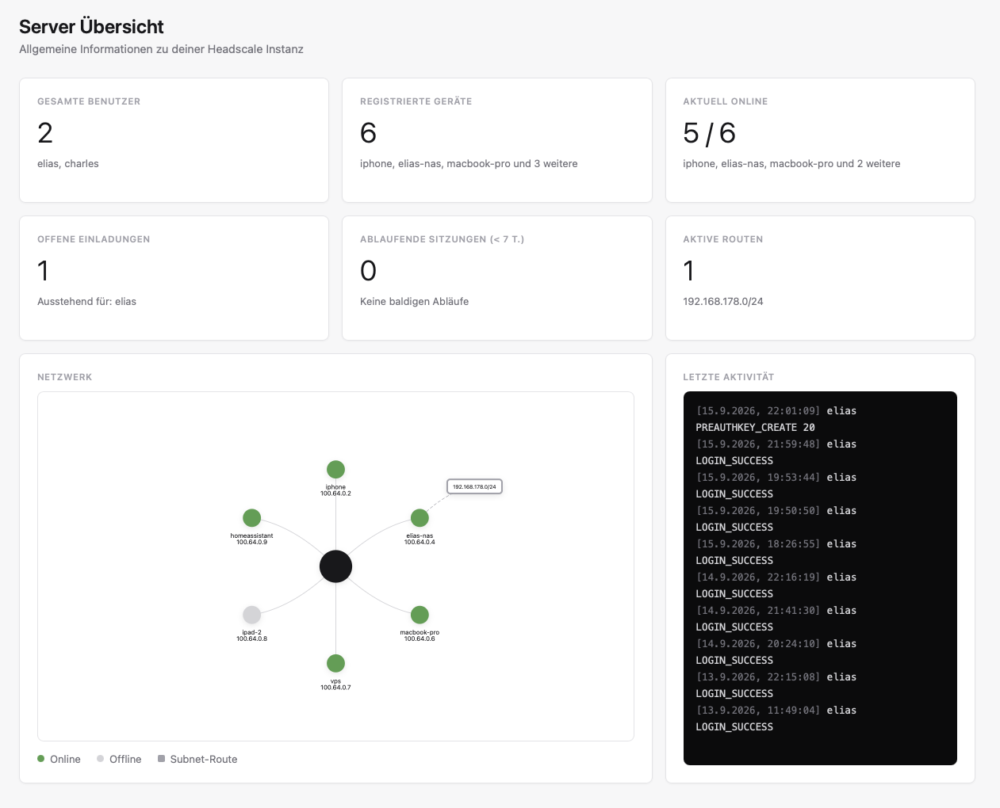
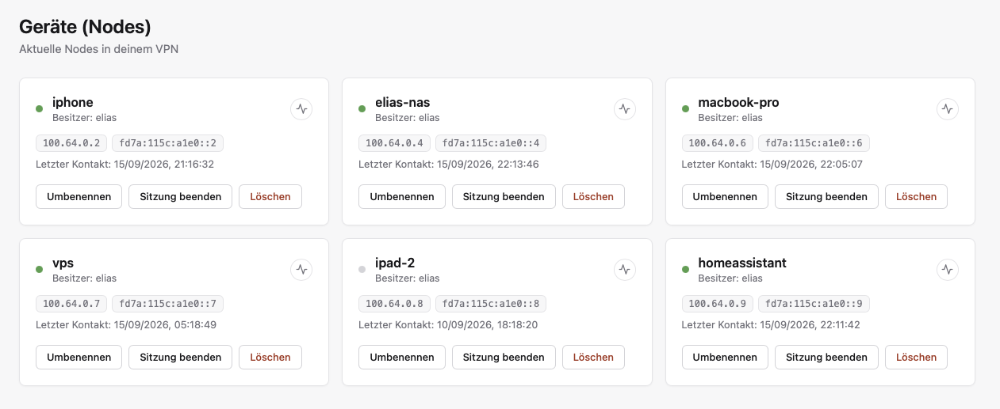
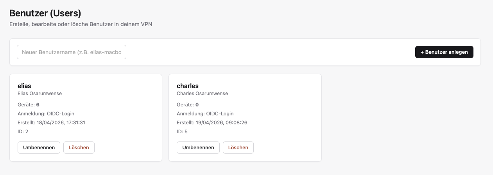
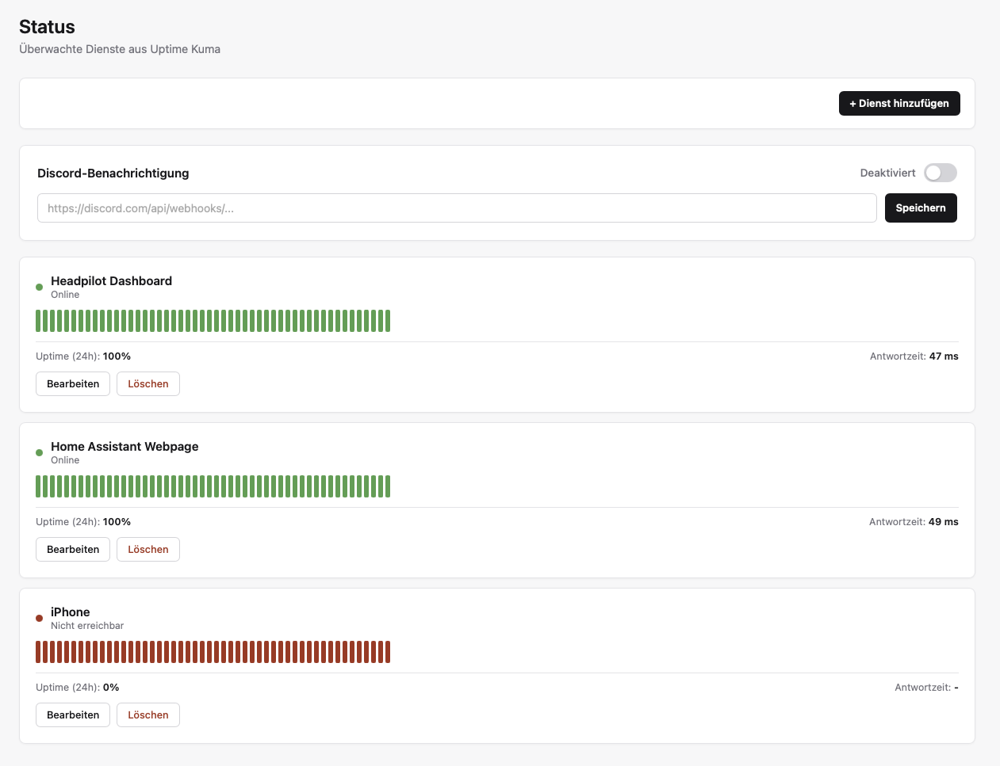
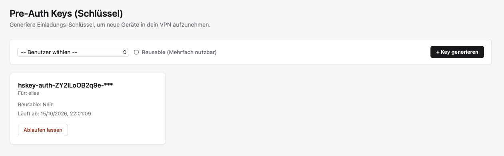

#  Headpilot

A custom admin dashboard for [Headscale](https://headscale.net/), the self-hosted replacement for Tailscale's coordination server. Headscale doesn't ship with a web interface out of the box, just a REST API and a CLI. Headpilot fills that gap: manage devices, create users, approve subnet routes, generate pre-auth keys and see the state of the whole tailnet at a glance, all through a normal web UI instead of SSH and CLI commands.

Login runs through a separate Keycloak server via OIDC. Headpilot itself doesn't manage passwords or accounts for dashboard access.

## Dashboard

Shows at a glance how many users and devices exist, how many are currently online, open pre-auth keys, sessions expiring soon and approved subnet routes. Below that, an interactive graph of the whole tailnet plus a log of the most recent security-relevant actions (logins, changes to devices, users and routes).



## Devices

All registered nodes in the tailnet as cards, with online status, IPv4/IPv6 addresses, owner and last seen time. Right from the card you can rename a device, expire its session, delete it or ping it.



## Users

Create, rename and delete Headscale users. Anyone who logged in via Keycloak automatically shows their display name and login method, plus how many devices are currently assigned to that user.



## Status

Hooks into an existing [Uptime Kuma](https://github.com/louislam/uptime-kuma) instance directly through its Socket.IO interface, live and without a public status page. Monitors can be created, edited and deleted right from Headpilot, including history bars and response times. A Discord notification for outages can be turned on with a single click.



## Pre-Auth Keys

Generate invite keys for new devices, reusable or one-time, with an expiration date. Keys that are no longer needed can be expired immediately.



## Other tabs

There's also a Subnet Routes tab (approve or disable advertised routes) and a Docker tab that checks over SSH which containers are running on each device, handy for seeing at a glance whether something like Home Assistant or a reverse proxy is still up.

## Setup

```bash
npm install
cp .env.example .env
```

At minimum, `.env` needs `HEADSCALE_URL`, `HEADSCALE_API_KEY`, the Keycloak variables (`KEYCLOAK_REALM_URL`, `KEYCLOAK_CLIENT_ID`, `KEYCLOAK_CLIENT_SECRET`, `REDIRECT_URI`) and a random `SESSION_SECRET`. Uptime Kuma, the encrypted SSH credential store and the Postgres audit log are optional, if the corresponding variables are missing, that feature just turns itself off cleanly instead of crashing.

```bash
npm start
```

Runs on `http://localhost:3000`.

## Tech stack

Node.js with Express on the backend, no framework on the frontend on purpose, just plain JavaScript and server-rendered HTML fragments. The network graph runs on [vis-network](https://visjs.github.io/vis-network/), the Kuma integration uses its regular Socket.IO interface. SSH credentials, if you choose to save them, are stored AES-256-encrypted on the server, never in plain text.

## Note

Headpilot is a private project built for my own tailnet and tailored to my specific use case. It doesn't aim to cover every Headscale feature or to translate 1:1 to every setup.
